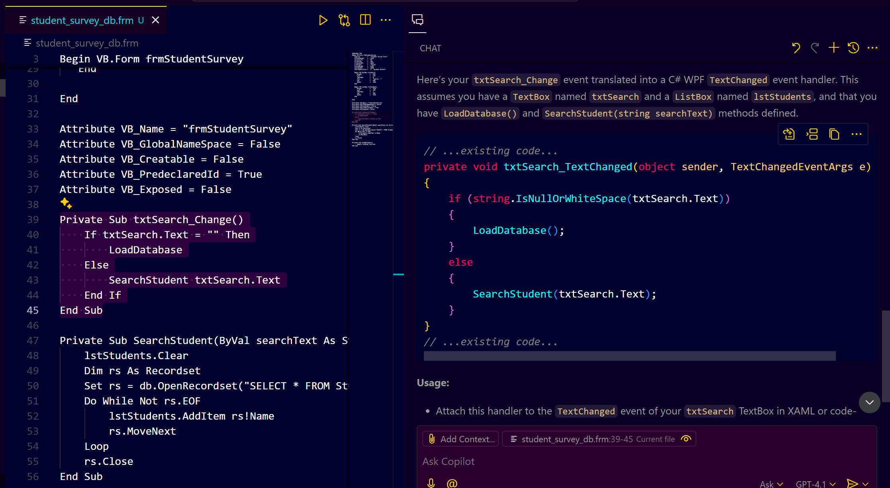

# **GitHub Copilot Magic: VB6 to WPF & Electron Migration Unleashed!**

## **Prerequisites**

* **Visual Basic 6 Development Environment**: Ensure you have access to the original VB6 project files.
* **GitHub Copilot**: Installed and configured in your IDE (e.g., Visual Studio Code).
* **Target Environment**: Set up for either WPF (using C#) or Electron (using JavaScript/TypeScript).

---

## **Step 1: Acquire the VB6 Form (`student_survey_db.frm`)**

* To begin, you'll need a VB6 form file to work with. You can obtain a sample student management system in VB6 from 
* After downloading, extract the contents and locate the `student_survey_db.frm` file.

---

## **Step 2: Test Copilot with a Simple VB6 Function**

Open the `student_survey_db.frm` file and identify a simple function. For instance:

```vb
Private Sub txtSearch_Change()
    If txtSearch.Text = "" Then
        LoadDatabase
    Else
        SearchStudent txtSearch.Text
    End If
End Sub
```


**Prompt**:

```plain text
Translate the above VB6 code into a C# method suitable for WPF.
```

**Copilot suggestion:**

Copilot generates a corresponding C# method, handling the `TextChanged` event and invoking appropriate methods based on the input.

---

## **Step 3: Convert a More Complex Function**

Next, select a more involved function, such as one that interacts with a database:

```vb
Private Sub SearchStudent(ByVal searchText As String)
    lstStudents.Clear
    Dim rs As Recordset
    Set rs = db.OpenRecordset("SELECT * FROM Students WHERE Name LIKE '%" & searchText & "%'")
    Do While Not rs.EOF
        lstStudents.AddItem rs!Name
        rs.MoveNext
    Loop
    rs.Close
End Sub
```


**Prompt**:

```plain text
Convert the above VB6 function into a C# method using ADO.NET for WPF, ensuring proper parameterization to prevent SQL injection.
```

**Copilot suggestion:**

Copilot should produce a C# method that uses `SqlConnection`, `SqlCommand`, and `SqlDataReader`, with parameterized queries to enhance security.

---

## **Step 4: Refactor Using Design Patterns**

To improve code maintainability, you can request Copilot to apply design patterns. For example:

**Prompt**:

```plain text
Refactor the previous C# method to implement the Strategy pattern for validation logic, and add comments for clarity.
```

**Copilot suggestion:**

Copilot will restructure the code, separating validation logic into distinct classes or methods, and annotate the code with comments explaining each part.

---

## **Step 5: Migrate VB6 UI Controls to WPF**

Identify UI elements in your VB6 form, such as:

```vb
Text1.Text = "Enter Name"
Text2.Text = "Enter Age"
```


**Prompt**:

```plain text
Convert the above VB6 text boxes into WPF XAML controls, applying appropriate styling.
```

**Copilot suggestion:**
Copilot should generate XAML code resembling:


You can further ask Copilot to define `TextBoxStyle` in your resource dictionary for consistent styling across the application.

---

## **Step 6: Convert UI to Electron (HTML/CSS/JS)**

If targeting Electron for cross-platform compatibility, convert the UI elements accordingly.

**Prompt**:

```plain text
Translate the following VB6 UI elements into HTML form controls suitable for an Electron application.
```

**Copilot suggestion:**
Copilot will output HTML code such as:


---

## **Step 7: Convert Backend Logic to Electron (Node.js)**

For backend operations in Electron, such as database interactions, convert the VB6 logic to Node.js.

**Prompt**:

```plain text
Rewrite the following VB6 database access code into a Node.js function using SQLite for an Electron application.
```

**Copilot suggestion:**

Copilot should generate a Node.js function utilizing the `sqlite3` package:


> Ensure you have the `sqlite3` package installed in your Electron project to use this code.

---

## **Conclusion**

* **Iterative Testing**: After each conversion, test the functionality to ensure accuracy.
* **Security Considerations**: Always use parameterized queries to prevent SQL injection.
* **Code Organization**: Maintain a clean project structure, separating concerns appropriately.
* **Documentation**: Keep your code well-documented to facilitate future maintenance.

By following this guide and leveraging GitHub Copilot, you can efficiently migrate your VB6 application to modern platforms like WPF or Electron, enhancing its functionality and maintainability.
