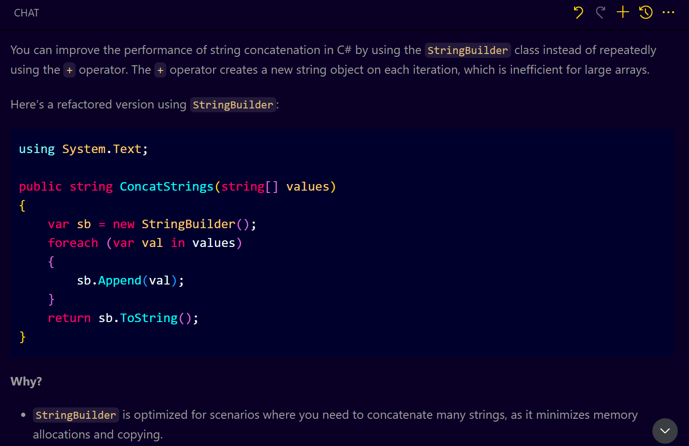
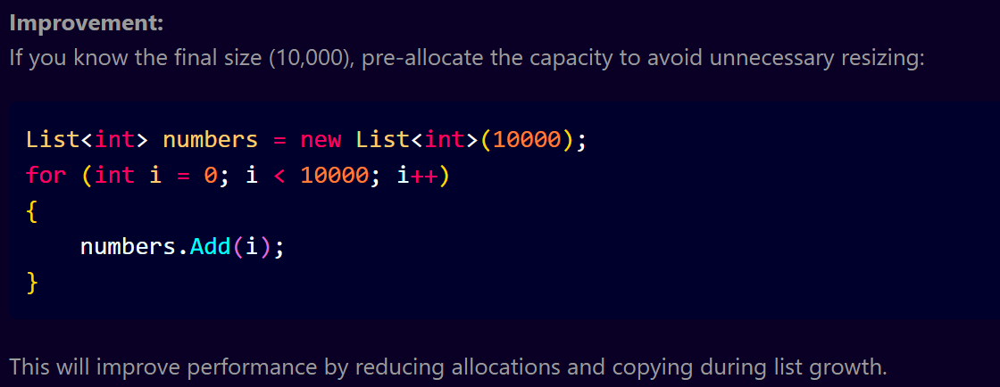

# **Mastering Code Reviews with GitHub Copilot – Speed & Performance (Part 2)**

Let’s explore how GitHub Copilot can assist in:

* Identify performance bottlenecks
* Suggest optimizations
* Improve concurrency handling
* Reduce memory usage
* Avoid common performance anti-patterns

This approach aligns with **Pluralsight's Code Review Checklist**, with particular attention to the "Speed and Performance" section.

---

## **String Concatenation** – Avoid `+` in loops

**File:** `performance.cs`
```csharp
public string ConcatStrings(string[] values)
{
    string result = "";
    foreach (var val in values)
    {
        result += val;
    }
    return result;
}
```
**Issue:** Inefficient use of `+` in a loop for string concatenation.

**Prompt to Copilot:**

```plain text
How can I improve performance of this string concatenation?
```

**Copilot Suggestion:**


> **Why?** `+` creates new string instances each time. `StringBuilder` is memory-efficient and faster.

---

## **List Allocation and Loop Optimization**

**File:** `listPerformance.cs`
```csharp
List<int> numbers = new List<int>();
for (int i = 0; i < 10000; i++)
{
    numbers.Add(i);
}
```

**Issue:** List is dynamically resized on each insert. Uses `for` unnecessarily.

**Prompt:**
```plain text
Any performance issue with list allocation here?
```

**Copilot Suggestion:**
Pre-allocate the list with expected capacity and consider using `foreach` for read-only operations.


> **Why?** Avoids dynamic resizing and improves cache locality.

---

## **File I/O – Handling High Concurrency**

**File:** `fileWrite.cs`

```csharp
File.WriteAllText("log.txt", "Writing log");
```

**Scenario:** Multiple concurrent users writing to a file. Risk of data race & lock contention.

**Prompt:**
```plain text
How can I handle 10,000 concurrent file writes without using a DB?
```

**Copilot Suggestion:**
Use async methods, batching, and queuing. Also include locking.

```csharp
private static readonly SemaphoreSlim _semaphore = new(1, 1);

public async Task WriteLogAsync(string log)
{
    await _semaphore.WaitAsync();
    try
    {
        await File.AppendAllTextAsync("log.txt", log + Environment.NewLine);
    }
    finally
    {
        _semaphore.Release();
    }
}
```

> **Why?** Prevents race conditions and supports high-throughput scenarios without a database.

---

## **Sorting Algorithm Efficiency**

**File:** `sort.cs`
```csharp
public void Sort(int[] arr)
{
    for (int i = 0; i < arr.Length - 1; i++)
    {
        for (int j = 0; j < arr.Length - i - 1; j++)
        {
            if (arr[j] > arr[j + 1])
            {
                var temp = arr[j];
                arr[j] = arr[j + 1];
                arr[j + 1] = temp;
            }
        }
    }
}
```

**Issue:** Bubble sort is used; poor performance for large datasets.

**Prompt:**
```plain text
Is this the most efficient sorting algorithm for large arrays?
```

**Copilot Suggestion:**
Use built-in `Array.Sort()` or a more optimized algorithm like `QuickSort`.

```csharp
Array.Sort(arr);
```

> **Why?** Built-in sort uses optimized hybrid algorithms and is faster for real-world use.

---

## **Logging Overhead**

**File:** `logging.cs`

```csharp
for (int i = 0; i < 1000; i++)
{
    Console.WriteLine($"{DateTime.Now} - Processed item {i}");
}
```

**Issue:** Logging inside a loop, excessive log writes, redundant timestamping.

**Prompt:**
```plain text
Are there performance issues in my logging code?
```

**Copilot Suggestion:**
Move logs outside loops or reduce frequency. Use log levels and async logging.

```csharp
var startTime = DateTime.Now;
for (int i = 0; i < 1000; i++) { /* logic */ }
Console.WriteLine($"{startTime} - Batch processed 1000 items.");
```

> **Why?** Reduces I/O overhead, improves log clarity, avoids timestamp recalculation.

---

## **Code Duplication – OOP Best Practices**

**File:** `animal.py`

**Issue:** Repeating logic in subclasses instead of reusing parent methods.

```python
class Animal:
    def make_sound(self):
        print("Animal sound")

class Dog(Animal):
    def make_sound(self):
        print("Woof")

class Cat(Animal):
    def make_sound(self):
        print("Meow")
```

**Prompt:**
```plain text
Any code duplication in this class structure?
```

**Copilot Suggestion:**
Avoid reimplementing sound logic if not customized. Use `super()` or restructure.

> **Why?** Reduces maintenance overhead and improves DRY (Don't Repeat Yourself) compliance.

---

## **HTML/JS Performance**

**File:** `index.html`
**Issue:** Inline styles, heavy DOM manipulation in loops

**Prompt:**
```plain text
How can I improve HTML performance in this code?
```

**Copilot Suggestion:**

* Move styles to external CSS
* Minimize layout reflows
* Use `documentFragment` for batch DOM updates

```js
const fragment = document.createDocumentFragment();
for (let i = 0; i < 1000; i++) {
    const div = document.createElement("div");
    div.textContent = i;
    fragment.appendChild(div);
}
document.body.appendChild(fragment);
```

---

## **Summary**

With GitHub Copilot, **performance code reviews** are faster and more actionable. It helps with:

| 🔍 Area              | ✅ Copilot Helps With            |
| -------------------- | ------------------------------- |
| String Concatenation | Use `StringBuilder`             |
| List Management      | Pre-allocation, `foreach`       |
| File I/O             | Async, `SemaphoreSlim`          |
| Sorting              | Avoid naive sort, use built-in  |
| Logging              | Reduce frequency, batch         |
| Duplication          | Refactor OOP structures         |
| HTML/JS              | DOM optimization, CSS structure |

