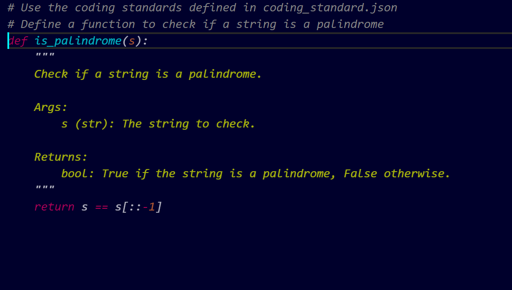
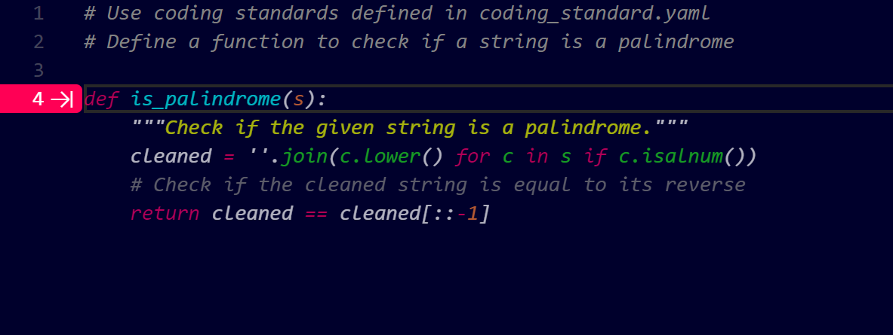

# **Custom Coding Standards with GitHub Copilot**

## **Overview**

GitHub Copilot doesn’t "learn" your custom coding standards permanently. However, it is **context-aware** — meaning it will adapt its code suggestions based on:

* Open files and project structure
* Previous prompts in the chat
* Code you supply in your workspace (e.g., a JSON/YAML with rules)

---

## **Step-by-Step Guide: Custom Coding Standards with Copilot**

### **Step 1: Define Your Coding Standard**

You can define coding standards in a file using **JSON**, **YAML**, or even **inline comments**.

**JSON Example (`coding_standard.json`)**

```json
{
  "function_naming": "snake_case",
  "class_naming": "PascalCase",
  "constant_naming": "UPPER_CASE",
  "docstring_style": "numpy",
  "comment_style": "full_sentence_capitalized"
}
```


**YAML Example (`coding_standard.yaml`)**
```yaml
function_naming: camelCase
class_naming: PascalCase
constant_naming: UPPER_CASE
docstring_style: google
comment_style: full_sentence_capitalized
```

---

### **Step 2: Add This File to Your Workspace**

Place `coding_standard.json` or `coding_standard.yaml` in your open project/workspace where Copilot can "see" it.

This works **best** in **VS Code** or **GitHub Copilot Chat in VS Code Insiders**.

---

### **Step 3: Prompt Copilot with a Task + Mention the Coding Standard**

**Prompt Example:**
Use a clear prompt like this:

```python
# Use the coding standards defined in coding_standard.json
# Define a function to check if a string is a palindrome
```

---

**Copilot Suggestion (with `snake_case` from JSON)**




**Notice:**
* Function name: `snake_case`
* Docstring: NumPy-style
* Clear, capitalized comment structure

---

### **Step 4: Change the Coding Standard and Regenerate**

Update the YAML to use **camelCase** and regenerate.

**YAML:**

```yaml
function_naming: camelCase
```

**Prompt Again:**

```python
# Use coding standards defined in coding_standard.yaml
# Define a function to check if a string is a palindrome
```

---

**Copilot Suggestion (with `camelCase`)**



✔️ Adheres to:
* Function name: `camelCase`
* Docstring: Google-style
* Variables: `camelCase` remains intact

---

### **Step 5: Use Constants with Your Custom Standard**

**Prompt Example:**

```python
# Use coding standards from coding_standard.yaml
# Define a function to calculate simple interest
# Interest rate should be defined as a constant
```

---

### **Copilot Suggestion:**

```python
INTEREST_RATE = 0.05  # 5% interest

def calculateInterest(principal, time):
    """
    Calculate simple interest based on the principal and time.

    Args:
        principal (float): The principal amount.
        time (int): Time in years.

    Returns:
        float: Calculated interest.
    """
    return principal * INTEREST_RATE * time
```

✔️ `INTEREST_RATE` follows UPPER\_CASE format
✔️ `calculateInterest` is camelCase
✔️ Google-style docstring

---

### **Step 6: Reminder — Context Fades Over Time**

After 10–15 prompts, Copilot may **lose the coding standard context**. You should:

* Re-add a reference to the JSON/YAML file in your prompt
* Or re-open the file in your editor

**Best Practice:**

```python
# Refer to coding_standard.json for naming conventions
```

---

### **Inline Standard Without External File**

If you don’t want to use a JSON/YAML file, define standards inline:

**Prompt:**

```python
# Follow these coding standards:
# - Function names: camelCase
# - Class names: PascalCase
# - Constants: UPPER_CASE
# - Docstring: Google style
# Define a class for BankAccount with methods to deposit and withdraw
```

---

**Copilot Suggestion:**

```python
class BankAccount:
    """
    A class representing a bank account.
    """

    def __init__(self, initialBalance=0):
        self.balance = initialBalance

    def deposit(self, amount):
        """
        Deposit money into the account.

        Args:
            amount (float): The amount to deposit.
        """
        self.balance += amount

    def withdraw(self, amount):
        """
        Withdraw money from the account.

        Args:
            amount (float): The amount to withdraw.
        """
        self.balance -= amount
```

---

## **Summary Table**

| Feature             | Supported via Copilot Context          |
| ------------------- | -------------------------------------- |
| Function Naming     | ✅ (snake\_case, camelCase)             |
| Class Naming        | ✅ (PascalCase)                         |
| Constant Formatting | ✅ (UPPER\_CASE)                        |
| Docstring Style     | ✅ (Google, NumPy)                      |
| Reusability         | ⚠️ (Needs reminder every \~15 prompts) |
| File-based Standard | ✅ JSON/YAML                            |
| Learning from Past  | ❌ (Not persistent across sessions)     |


