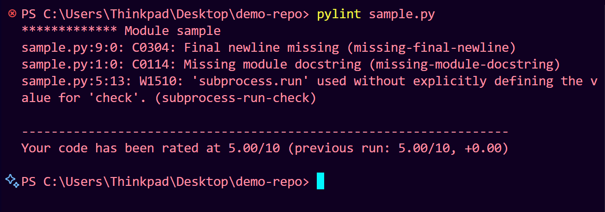
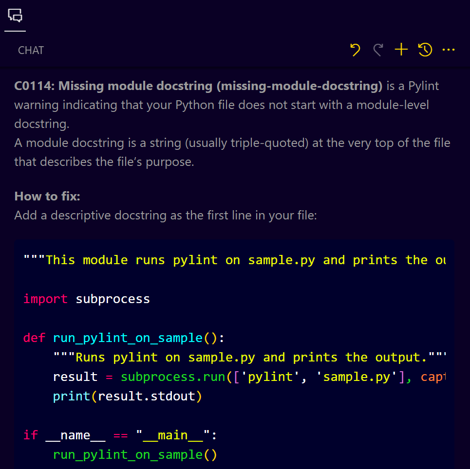
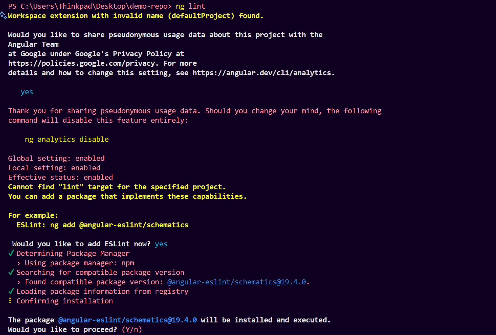
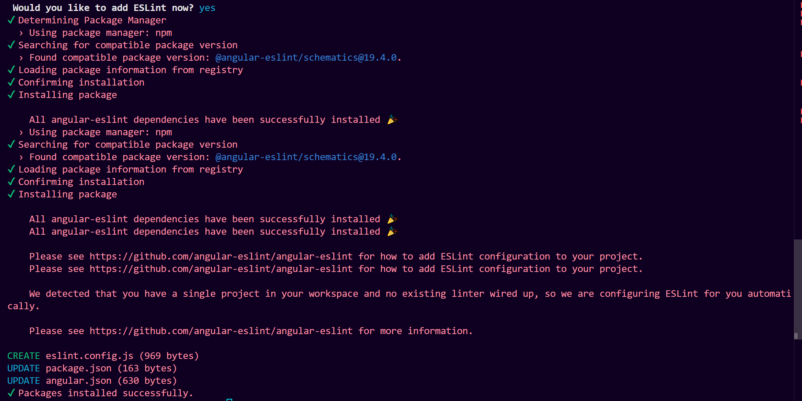
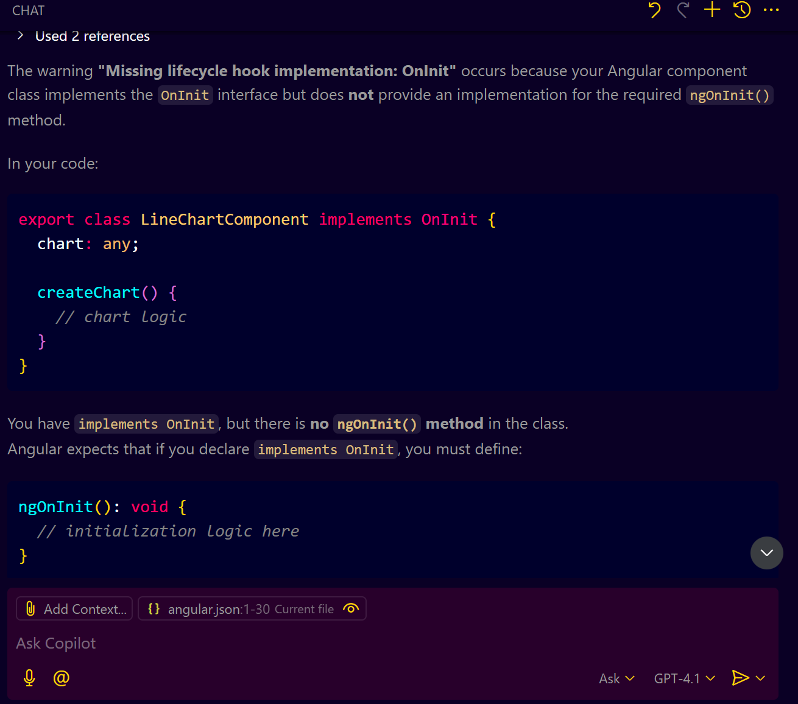

# **Lint Error Fixes with GitHub Copilot: Python and Angular Edition**


## **What Is Linting?**

Linting is a **static code analysis** technique used to identify code issues such as:

* Style violations (e.g., naming conventions)
* Missing documentation
* Unused variables
* Incorrect formatting
* Best practice violations

---

## **Section 1: Fixing Lint Errors in Python using GitHub Copilot**

### **Tools Used:**
* `pylint` (or `flake8`, `black`, `ruff`)
* GitHub Copilot Chat
* Install **Pylint**  

```bash
pip install pylint
```

---

### **Step-by-Step for Python**

#### **Step 1: Run the Linter**

**Sample.py**
```python
import subprocess

def run_pylint_on_sample():
    """Runs pylint on sample.py and prints the output."""
    result = subprocess.run(['pylint', 'sample.py'], capture_output=True, text=True)
    print(result.stdout)

if __name__ == "__main__":
    run_pylint_on_sample()
```


**Run python Script**

```bash
pylint sample.py
```

**Sample Output:**


---

#### **Step 2: Ask Copilot to Explain the Error**

**Prompt to Copilot Chat**:
```plain text
what does C0114: Missing module docstring (missing-module-docstring) mean?
```

**Copilot Suggestion**:



---

#### **Step 3: Ask Copilot to Fix the Issue**

**Prompt to Copilot Chat**:
```plain text
Fix all lint errors in this Python code:
```

**Example Before Fix:**

```python
num = 5

def say_hello():
    print("Hello")
```

**Copilot Output**:

```python
NUM = 5

def say_hello():
    """Prints a greeting message."""
    print("Hello")
```

---

#### **Step 4: Add Missing Docstrings**

**Prompt**:
```plain text
Add module-level and function-level docstrings to this code.
```

**Copilot Output**:

```python
"""This module provides a simple greeting example."""

NUM = 5

def say_hello():
    """Prints a greeting message."""
    print("Hello")
```

---

#### **Result:**

Run `pylint sample.py` again and verify that issues are resolved.

---

## **Section 2: Fixing Lint Errors in Angular using GitHub Copilot**

### **Tools Used:**

* `ng lint`
* GitHub Copilot Chat

---

### **Step-by-Step for Angular**

#### **Step 1: Run the Angular Linter**
**Sample.ts**
```ts
import { Component, OnInit } from '@angular/core';

@Component({
  selector: 'app-line-chart',
  templateUrl: './line-chart.component.html',
})
export class LineChartComponent implements OnInit {
  chart: any;

  createChart() {
    // chart logic
  }
}
```

**angular.json**
```json
{
  "$schema": "./node_modules/@angular/cli/lib/config/schema.json",
  "version": 1,
  "defaultProject": "demo-repo",
  "projects": {
    "demo-repo": {
      "projectType": "application",
      "root": "",
      "sourceRoot": "src",
      "architect": {
        "lint": {
          "builder": "@angular-eslint/builder:lint",
          "options": {
            "lintFilePatterns": [
              "src/**/*.ts",
              "src/**/*.html"
            ]
          }
        }
      }
    }
  },
  "cli": {
    "analytics": "07f2b5fe-c46b-4569-9c83-3ddafff5f2fe",
    "schematicCollections": [
      "angular-eslint"
    ]
  }
}
```

**Run the script**
```bash
ng lint
```


**Sample Output:**





---

#### **Step 2: Ask Copilot to Explain the Error**

**Prompt to Copilot Chat**:
```plain text
Explain why this Angular code reports "Missing lifecycle hook implementation: OnInit"
```

**Copilot Output**:


> This component declares that it implements `OnInit` but does not define the `ngOnInit()` method. You should implement `ngOnInit()` when using `OnInit`.

---

#### **Step 3: Ask Copilot to Fix the Issue**

**Example Before Fix:**

```ts
import { Component, OnInit } from '@angular/core';

@Component({
  selector: 'app-line-chart',
  templateUrl: './line-chart.component.html',
})
export class LineChartComponent implements OnInit {
  chart: any;

  createChart() {
    // chart logic
  }
}
```

**Prompt to Copilot Chat**:
```plain text
Fix all lint errors in this Angular code.
```


**Copilot Output**:

```ts
import { Component, OnInit } from '@angular/core';
import { Chart } from 'chart.js';

@Component({
  selector: 'app-line-chart',
  templateUrl: './line-chart.component.html',
})
export class LineChartComponent implements OnInit {
  public chart!: Chart;

  ngOnInit(): void {
    this.createChart();
  }

  createChart(): void {
    // chart logic
  }
}
```

---

### **Step 4: Rerun the Linter**

```bash
ng lint
```

**Expected Result:**
Errors drop from 24 to 18 or fewer. Repeat the Copilot-assisted fixes until you're lint-free!

---

## **Final Tips to Maximize Copilot for Lint Fixes**

| Action                           | Prompt Example                                         |
| -------------------------------- | ------------------------------------------------------ |
| Explain specific lint error      | "What does `Missing module docstring` mean?"           |
| Fix one issue                    | "Fix the naming convention issue in this code"         |
| Fix all lint issues              | "Fix all lint errors in this file"                     |
| Add docstrings                   | "Add function and module-level docstrings"             |
| Enforce strict typing in Angular | "Replace `any` with a specific type in this component" |
