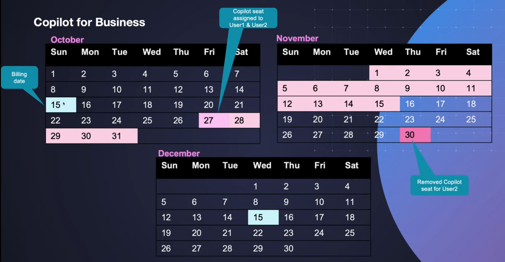

# **GitHub Copilot Billing 6 Nov 2023**

Here's a **step-by-step detailed guide with tables** summarizing the **GitHub Copilot billing model** as of **November 6, 2023**, covering both **Individual** and **Business (Enterprise)** tiers, proration, seat management, and Azure billing integration.

---

## **GitHub Copilot SKUs (Licensing Options)**

| SKU                    | Target Audience     | Monthly Cost    | Trial               | Notes                                                       |
| ---------------------- | ------------------- | --------------- | ------------------- | ----------------------------------------------------------- |
| **Copilot Individual** | Individual users    | \$10/month      | ✅ 30-day free trial | License is tied to the GitHub handle                        |
| **Copilot Business**   | Organizations/Teams | \$19/user/month | ❌                   | Centralized management, policy control, enterprise features |

---

## **Copilot Individual Billing**

### **Features:**

* \$10/month per user
* 30-day free trial
* Can enable/disable usage of your code for model training
* License is bound to the **GitHub account**
* Simple billing through **github.com billing settings**

---

## **Copilot for Business – Key Features**

| Feature                   | Description                                                      |
| ------------------------- | ---------------------------------------------------------------- |
| Centralized Management    | Admins can manage licenses, billing, and settings from one place |
| Policy Settings           | Control access, public code blocking, team enablement, etc.      |
| License Flexibility       | Add/remove users monthly                                         |
| Usage Reporting           | See who uses Copilot and how often                               |
| Azure Billing Integration | Option to link GitHub Copilot billing to Azure subscription      |

---

## **Copilot Business Billing Example**

| Scenario                           | Action Date | Billing Impact                                         |
| ---------------------------------- | ----------- | ------------------------------------------------------ |
| User added mid-month (e.g. 27th)   | Nov 27      | Charged **prorated** from 27th to end of billing cycle |
| Billing cycle date                 | e.g. 15th   | Recurring monthly billing on 15th                      |
| User removed mid-month (e.g. 30th) | Nov 30      | Still billed **full month** until next cycle (Dec 15)  |

---

## **Proration Explained**

| Date Action           | Date of Billing Cycle Start | Billed Period   | Billed Amount                     |
| --------------------- | --------------------------- | --------------- | --------------------------------- |
| Add user on Nov 27    | Nov 15                      | Nov 27 – Dec 15 | Prorated amount (approx. 19 days) |
| Remove user on Nov 30 | Nov 15                      | Nov 15 – Dec 15 | Full month billed (no proration)  |

> 📝 **Note:** Always remove users before the billing date to avoid unnecessary charges.

---

## **Seat Management Best Practices**

| Strategy                               | Why It's Useful                                                    |
| -------------------------------------- | ------------------------------------------------------------------ |
| Monitor usage monthly                  | Optimize license usage                                             |
| Remove unused users before billing day | Avoid full-month charge on removals                                |
| Reassign seats strategically           | Save cost during non-coding project phases (e.g., design, release) |

---

## **Azure Subscription Integration**

### **Use Case:**

* Manage GitHub Copilot billing via **Azure Billing Portal**
* Treat Copilot as another Azure resource

### **Billing Cycle Change:**

| Action                              | Old Billing Cycle | New Billing Cycle                       |
| ----------------------------------- | ----------------- | --------------------------------------- |
| Link Copilot to Azure on 2nd        | 15th–15th monthly | **1st–1st monthly** (Azure default)     |
| Billing shifts from GitHub to Azure | After linking     | Reflected as a resource in Azure portal |

---

## **Summary Table: GitHub Copilot Billing**

| Feature               | Individual      | Business              |
| --------------------- | --------------- | --------------------- |
| Monthly Cost          | \$10            | \$19 per user         |
| Trial                 | 30 days         | ❌                     |
| License Scope         | Per GitHub user | Per organization      |
| Billing Method        | GitHub billing  | GitHub or Azure       |
| Billing Model         | Fixed           | Usage-based, prorated |
| Central Management    | ❌               | ✅                     |
| Policy Controls       | Limited         | Full admin control    |
| Code Training Opt-Out | ✅               | Admin controlled      |

---

## **Recommendations for Businesses**

1. **Monitor Usage:** Use centralized reports to track actual usage.
2. **Plan Removals:** Remove users just before the billing date to avoid paying full month.
3. **Azure Billing:** Use Azure for unified cost tracking if you already use Microsoft services.
4. **License Right-Sizing:** Adjust license counts monthly based on project needs.
