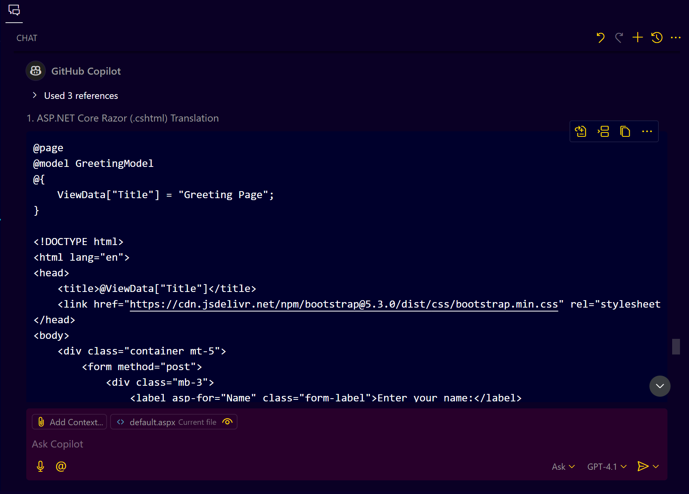

# **GitHub Copilot as a Migration Assistant**

**Copilot is not a migration tool**, but it can **significantly assist** with code **conversion, adaptation, and modernization** post core migration.

---

## **Migration Workflow with GitHub Copilot**

### **Core Migration** (Manual/Tool-based)

* Follow official migration guidelines.
* Reorganize project structure (e.g., convert `.aspx` to `.cshtml` or SPA components).
* Replace obsolete libraries.
* Set up new configurations (e.g., `appsettings.json`, `Startup.cs` in .NET Core).

**Tools for Core Migration**

* Microsoft Upgrade Assistant
* Manual refactoring
* .NET Portability Analyzer

---

### **Using GitHub Copilot After Core Migration**

#### **a. Translating Views**

**Input**: `.aspx` or `.aspx.cs`

**default.aspx**
```html
<%@ Page Language="C#" AutoEventWireup="true" CodeFile="Default.aspx.cs" Inherits="_Default" %>

<!DOCTYPE html>
<html xmlns="http://www.w3.org/1999/xhtml">
<head runat="server">
    <title>Greeting Page</title>
    <link href="https://cdn.jsdelivr.net/npm/bootstrap@5.3.0/dist/css/bootstrap.min.css" rel="stylesheet" />
</head>
<body>
    <form id="form1" runat="server" class="container mt-5">
        <div class="mb-3">
            <asp:Label ID="lblName" runat="server" Text="Enter your name:" CssClass="form-label"></asp:Label>
            <asp:TextBox ID="txtName" runat="server" CssClass="form-control"></asp:TextBox>
        </div>
        <asp:Button ID="btnGreet" runat="server" Text="Greet" OnClick="btnGreet_Click" CssClass="btn btn-primary" />
        <br /><br />
        <asp:Label ID="lblGreeting" runat="server" Text="" CssClass="fs-5 text-success"></asp:Label>
    </form>
</body>
</html>
```

**default.aspx.cs**

```cs
using System;

public partial class _Default : System.Web.UI.Page
{
    protected void Page_Load(object sender, EventArgs e)
    {
    }

    protected void btnGreet_Click(object sender, EventArgs e)
    {
        string name = txtName.Text;
        lblGreeting.Text = $"Hello, {name}!";
    }
}
```


**Prompt Copilot**:

```plaintext
Translate this ASPX view into ASP.NET Core Razor (.cshtml)
Translate this view into an Angular/React component
```

**Copilot suggestion**



* Converts server-side controls into client-side markup (`<asp:Label>` → `<span>`)
* Migrates Bootstrap, jQuery code as needed
* Can adapt to UI libraries (e.g., Angular Material)

---

#### **b. Translating Code-Behind**

**Input**: `Page_Load`, `Button_Click`, `DropDown_SelectedIndexChanged`, etc.

**ContactForm.aspx.cs**

```cs
using System;
using System.Web.UI;

public partial class ContactForm : Page
{
    protected void Page_Load(object sender, EventArgs e)
    {
        if (!IsPostBack)
        {
            ddlSubjects.Items.Add("Support");
            ddlSubjects.Items.Add("Sales");
            ddlSubjects.Items.Add("Feedback");
        }
    }

    protected void btnSubmit_Click(object sender, EventArgs e)
    {
        string name = txtName.Text;
        string email = txtEmail.Text;
        string subject = ddlSubjects.SelectedItem.Text;
        string message = txtMessage.Text;

        // Simulate saving to a database or sending an email
        lblStatus.Text = $"Message from {name} ({email}) on '{subject}' was submitted.";
    }

    protected void ddlSubjects_SelectedIndexChanged(object sender, EventArgs e)
    {
        lblSelectedSubject.Text = $"You selected: {ddlSubjects.SelectedItem.Text}";
    }
}
```


**Prompt Copilot**:

```plaintext
Convert this page lifecycle event code into Angular ngOnInit or constructor
Translate this code-behind file into ASP.NET Core Web API
```

**Copilot can generate:**

  * Angular/React service methods
  * API controller methods (`[HttpPost]`, `[HttpGet]`)
  * Separate model classes for inputs/outputs

---

#### **c. Mapping ASPX Page Lifecycle to New Lifecycle Hooks**

| Legacy Web Forms | Angular/React Equivalent     | MVC Equivalent |
| ---------------- | ---------------------------- | -------------- |
| `Page_Init`      | `constructor()`              | `OnGet()`      |
| `Page_Load`      | `ngOnInit()` / `useEffect()` | `OnPost()`     |
| `Button_Click`   | API call on click event      | Form POST      |

---

### **Post-Migration Enhancements with Copilot**

#### **a. Add Unit Tests**

```plaintext
Generate unit tests for this API controller using xUnit
```

#### **b. Add XML Documentation & Comments**

```plaintext
Add documentation and comments to this class
```

#### **c. Add Exception Handling**

```plaintext
Wrap each method in try-catch and log errors
```

#### **d. Detect & Fix Security Issues**

* Suggest secure coding practices
* Identify vulnerable patterns (e.g., hardcoded secrets, unsafe deserialization)

#### **e. Improve Performance & UX**

* Copilot can optimize loops, queries, etc.
* Suggest UI responsiveness improvements (e.g., lazy loading, form validation)

---


## **Tips for Using Copilot Effectively**

| Tip                  | Description                                                                       |
| -------------------- | --------------------------------------------------------------------------------- |
| 🎯 Be specific       | Specify the **target framework or library** (e.g., Angular Material, Razor Pages) |
| 📚 Split code        | Migrate **small parts at a time** – view, then controller, then models            |
| 🧪 Test              | Always test and verify the Copilot-generated code                                 |
| ⚙️ Customize prompts | Adjust your prompts to get more accurate results                                  |

---

## **Summary**

GitHub Copilot **augments** your migration journey, helping you:

* Translate legacy code to modern frameworks
* Add testability, documentation, error handling
* Convert UI and lifecycle logic effectively
* Fix outdated patterns and boost maintainability

**But remember:**

> **Copilot = Assistant, not a replacement for migration tools or your engineering judgment.**
