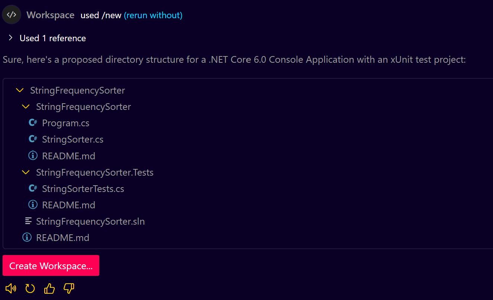
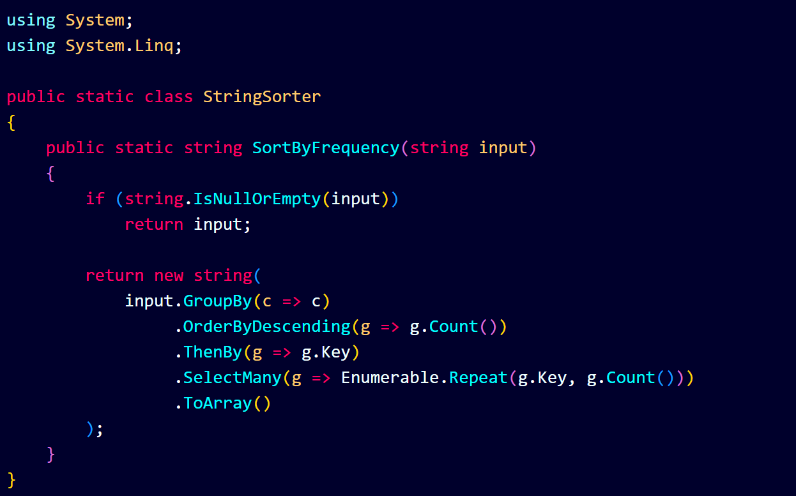
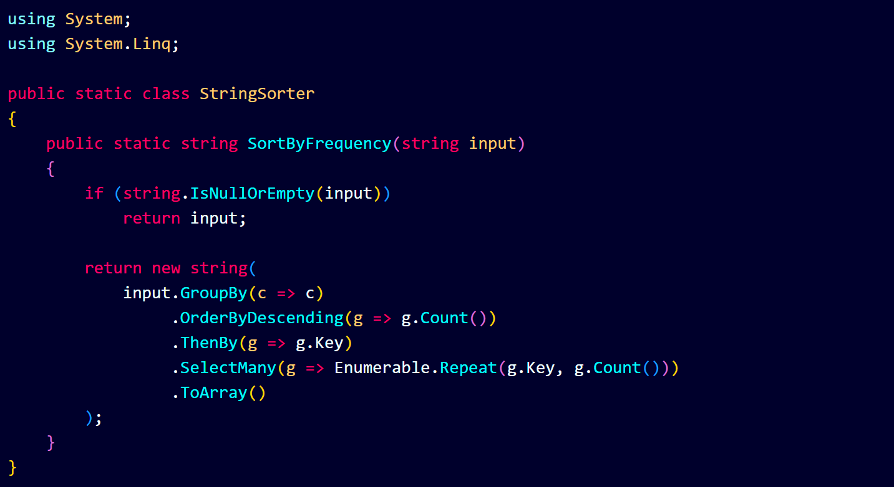
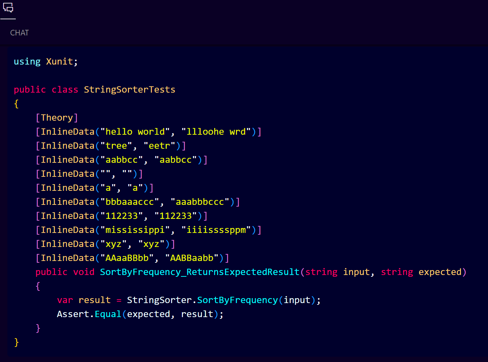

# **GitHub Copilot for Codeathon**

**GitHub Copilot for Codeathon** is an AI-powered coding assistant that helps participants quickly generate, debug, and test code during programming contests. It accelerates problem-solving by offering real-time suggestions, project setup, and test case generation based on natural language prompts.

---

## **Problem Statement**

**Given:** A string of characters (including spaces)
**Task:** Sort the string based on the frequency of each character in descending order.

If multiple characters have the same frequency, maintain their original order of appearance.

**Example:**
**Input:** `"hello world"`
**Output:** `"lll oohe wrd"`

**Explanation:**

* `l` appears 3 times → first
* `o` appears 2 times → second
* `h`, `e`, ` `, `w`, `r`, `d` appear once (original order preserved)

---

## **Step 1: Launch GitHub Copilot Chat**

Use **VS Code with GitHub Copilot Chat** or **GitHub Copilot in GitHub Codespaces / GitHub.dev**.

---

## **Step 2: Setup Project (with Prompt)**

### **Prompt Copilot:**

```plaintext
Create a .NET Core 6.0 Console Application with a method to sort a string by character frequency in descending order, including repetitions. Also add a test project using xUnit with test cases.
```

### **Copilot Suggestion**



---

## **Step 3: Let Copilot Generate the Sorting Logic**

### **Prompt:**

```plaintext
Write a method called SortByFrequency that takes a string and returns the string sorted by character frequency in descending order, repeating characters as per their count.
```

### **Copilot Suggestion:**


---

## **Step 4: Create Test Cases Using Copilot**

### **Prompt:**

```plaintext
Create xUnit test cases for the SortByFrequency method with various inputs like "hello world", "tree", "aabbcc", and edge cases like empty string and single characters.
```

### **Copilot suggestion Test Code:**

```csharp
public class CharacterSorterTests
{
    [Theory]
    [InlineData("hello world", "lllo ohe wrd")]
    [InlineData("tree", "ee tr")]
    [InlineData("aabbcc", "aabbcc")]
    [InlineData("", "")]
    [InlineData("x", "x")]
    public void TestSortByFrequency(string input, string expected)
    {
        var result = CharacterSorter.SortByFrequency(input);
        Assert.Equal(expected, result);
    }
}
```

---

## **Step 5: Build and Run the Project**

### **Prompt:**

```plaintext
Build and run the project to check if the output matches expectations.
```

* If there are errors (e.g., framework mismatch), Copilot can suggest fix prompts like:

  ```plaintext
  Update the project file to use net6.0 target framework.
  ```

---

## **Step 6: Fix Issues (if Output Is Not Repeating Characters)**

### **Problem:**

If Copilot generated:

```csharp
.OrderByDescending(g => g.Count()).Select(g => g.Key)
```

It returns each char once.

### **Prompt to Fix:**

```plaintext
Fix the SortByFrequency method to include repeated characters as per their frequency count.
```

### **Copilot Suggestion**


---

## **Step 7: Regenerate Tests If Method Changed**

### **Prompt:**

```plaintext
Generate new xUnit test cases based on the updated SortByFrequency method that repeats characters as per their frequency.
```

### **Copilot Suggests:**




---

## **Summary Prompts Cheat Sheet**

| **Prompt**                                  |  **Copilot Response**                    |
| ------------------------------------------ | -------------------------------------- |
| `Create a .NET 6 Console App`              | Initializes Program.cs                 |
| `Write method to sort string by frequency` | Generates `SortByFrequency()`          |
| `Fix method to repeat characters`          | Updates `.Select()` to `.SelectMany()` |
| `Create xUnit tests`                       | Generates `[Theory]` test class        |
| `Update test for repeated characters`      | Rewrites test expectations             |
| `Add using statements`                     | Adds `System.Linq`, etc.               |
| `Build and run`                            | Ensures no compilation/runtime issues  |

---

## **Final Output Example**

```csharp
// Program.cs
Console.WriteLine(SortByFrequency("hello world")); // Output: "llloohe wrd"
```

```csharp
// xUnit Tests
[InlineData("tree", "eetr")]
[InlineData("hello world", "llloohe wrd")]
```
