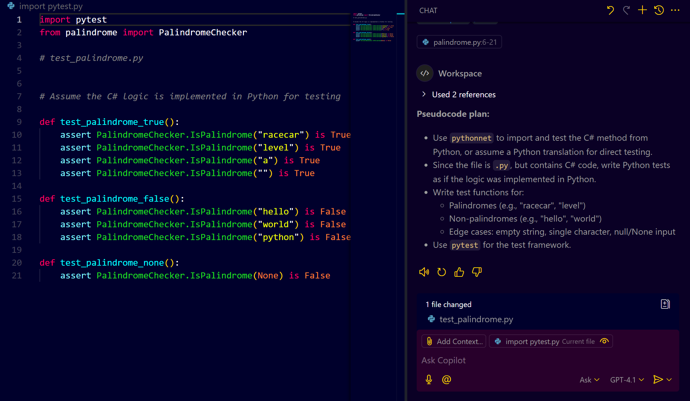
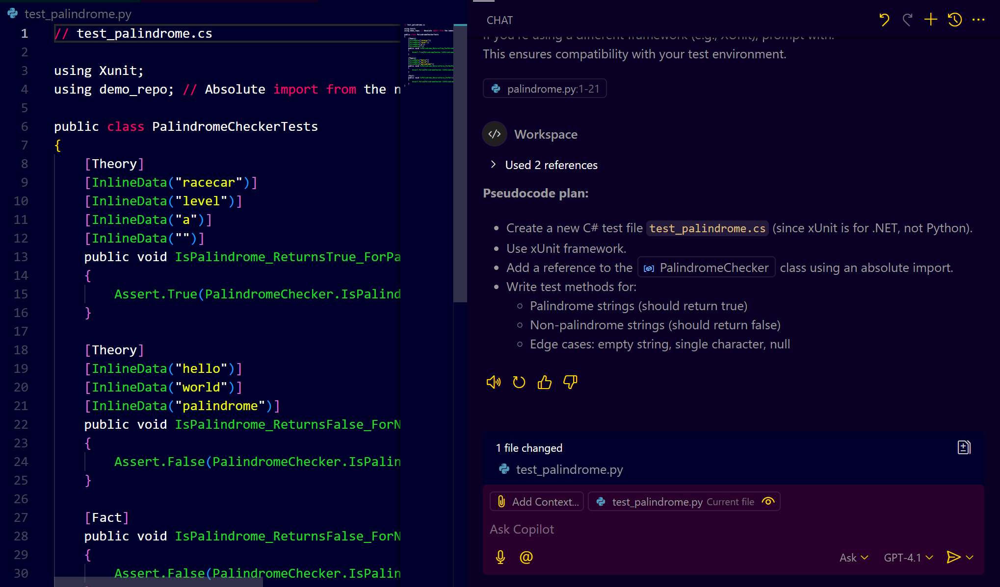
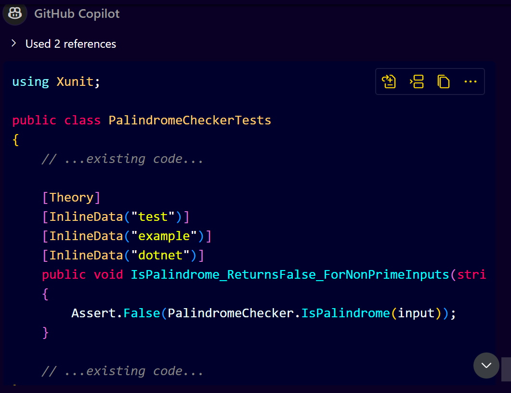
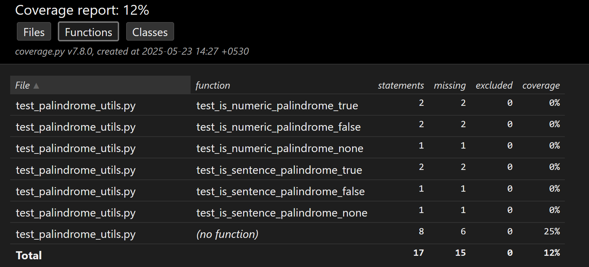

# **GitHub Copilot Chat for Unit Test Generation**

GitHub Copilot Chat helps you:

* Generate **unit test scripts** interactively.
* Support various **testing frameworks** like NUnit, XUnit, JUnit, etc.
* Handle **exceptions**, **edge cases**, **mocking**, and **data-driven tests**.
* Integrate with **VS Code** or temporarily use it for IntelliJ projects.

---

## **Basic Unit Test Generation**

### **Step 1: Select the Method**

Select the method you want to test in your code editor.

**is_palindrome.py**

```python
using System;
public static class PalindromeChecker
{
    public static bool IsPalindrome(string input)
    {
        if (input == null) return false;

        int left = 0;
        int right = input.Length - 1;

        while (left < right)
        {
            if (input[left] != input[right])
                return false;
            left++;
            right--;
        }
        return true;
    }
}
```


### **Step 2: Use Copilot Chat**

**Type:**

```
/tests
```

**Copilot Suggestion**


Copilot will auto-generate test cases for the method. For a `isPalindrome(string)` method, Copilot Chat generates:

* A test for a valid palindrome.
* A test for a non-palindrome.
* A test for an empty string.
* A test for a single character.
* A test for case sensitivity.

---

## **Customize for Framework**

### **Default is NUnit or similar.**

If you're using a different framework (e.g., XUnit), prompt with:

```
/test generate using xunit
```

**Copilot Suggestion**
This ensures compatibility with your test environment.




---

## **Prompt-Based Refinement**

You can ask for test cases for **specific edge cases**:

```
Write a unit test for non-prime input using xunit
```

**Use prompt-based refinement for:**


* Covering missing conditions.
* Adding more edge cases.
* Specifying mocking or exception handling.

---

## **Exception Handling**

**Given a method like `divide(int a, int b)`, simply type:**

```
/tests
```

**Copilot suggestion:**

* Test for valid division.
* Test for division by zero with proper exception assertion.

---

## **Data-Driven Tests**

**Ask:**

```
/tests generate data-driven test using theory
```

**Copilot suggestion:**

* Use `[Theory]` and `[InlineData]` for XUnit.
* Allow CSV-driven or inline datasets.
* Handle exception scenarios in test data too.

---

## **Java Support via IntelliJ**

**IntelliJ doesn’t yet support Copilot Chat natively.**

**Workaround:**

* Open your Java project in **VS Code**.
* Use Copilot Chat to generate JUnit tests.
* Copy generated tests back to IntelliJ.

### **Java Prompt Example:**

```
Add unit tests for divide() using JUnit and Mockito
```

---

## **Mocking & External Services**

If testing a service like `TodoService` that depends on an interface:

### **Prompt:**

```
/tests using mockito for TodoService
```

**Copilot Suggestion:**

* Generate mocks using `@Mock`, `@InjectMocks`.
* Use `Mockito.when(...).thenReturn(...)`.
* Ensure external dependencies are stubbed.

---

## **Validating Test Cases**

After generating:

1. Save the test file.
2. Run tests in your IDE.
3. Fix failed tests by aligning **expected vs actual** behavior.
4. Use `/fix` or ask Copilot Chat:

   ```
   Why is this test failing?
   ```

---

## **Coverage Check**

After tests run:

* Run with **coverage** to ensure all branches/conditions are tested.
* Green lines in IntelliJ or VS Code indicate full coverage.

---

## **Tips**

| Tip                      | Description                                                                 |
| ------------------------ | --------------------------------------------------------------------------- |
| 🧠 Be Specific           | Mention the framework, boundary case, or data-driven setup.                 |
| 🔁 Iterate               | Prompt again to add more edge case coverage.                                |
| ⚙️ Environment Match     | Ensure the test framework matches your dev environment (NUnit/XUnit/JUnit). |
| 🚫 Avoid False Positives | Verify that expected outputs are realistic.                                 |

---

## **Prompt Cheat Sheet**

| Task                     | Prompt                                         |
| ------------------------ | ---------------------------------------------- |
| Basic unit test          | `/test`                                        |
| Use a specific framework | `/test using xunit`                            |
| Generate for edge case   | `Write unit test for non-prime using xunit`    |
| Data-driven test         | `/test generate data-driven test using theory` |
| Java + Mockito           | `Add unit test using Mockito for method XYZ`   |
| Fix failing test         | `Why is this test failing?`                    |
