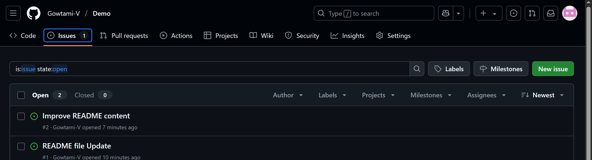
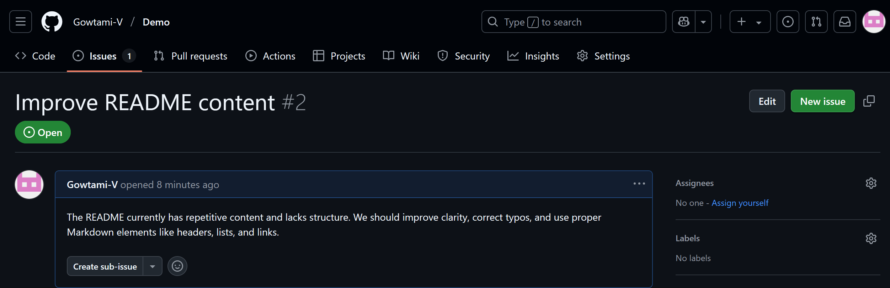
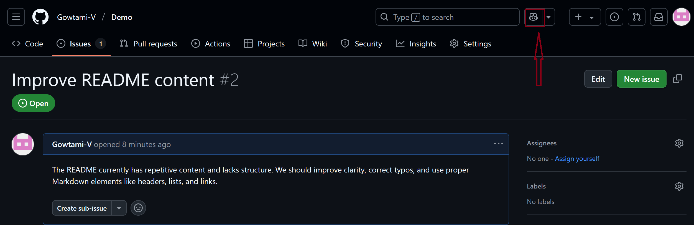
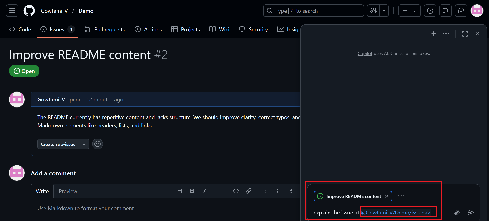
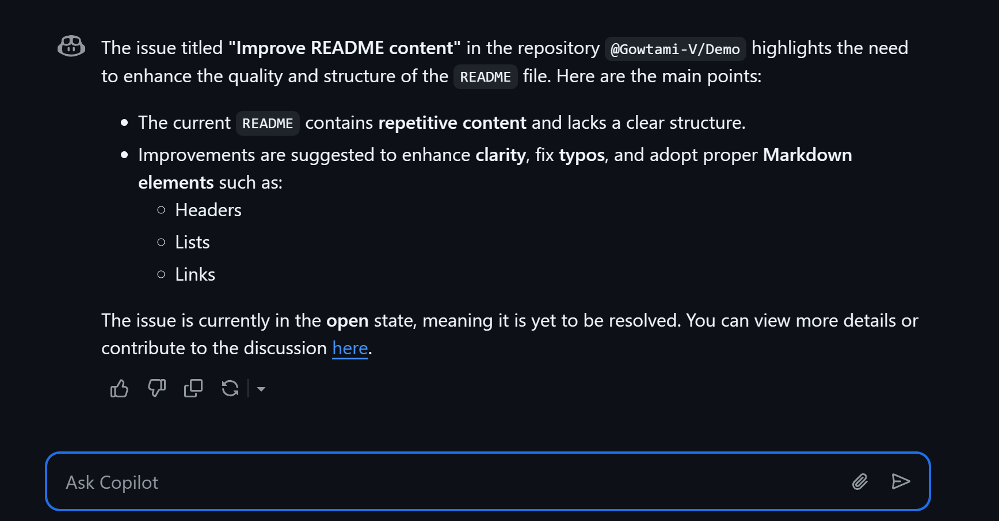
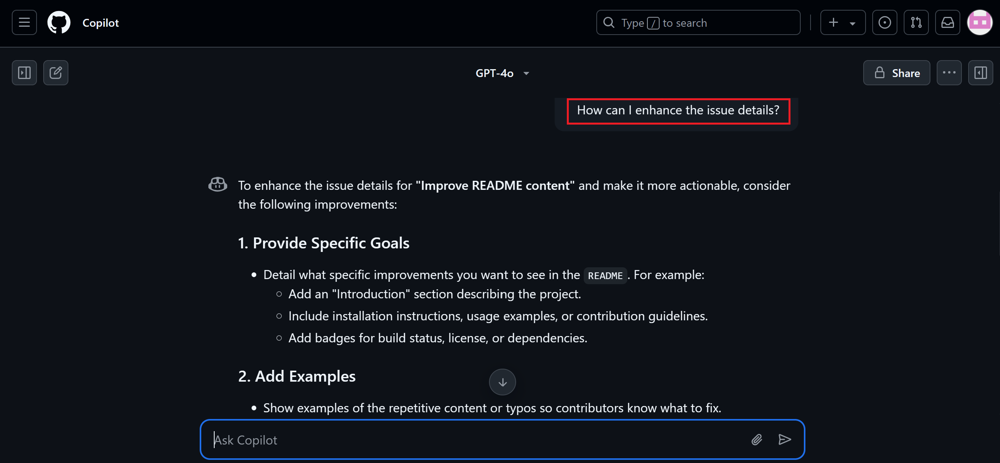
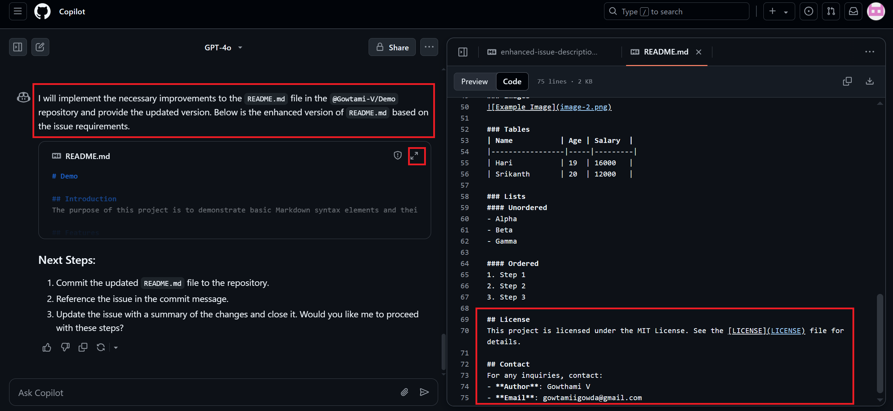
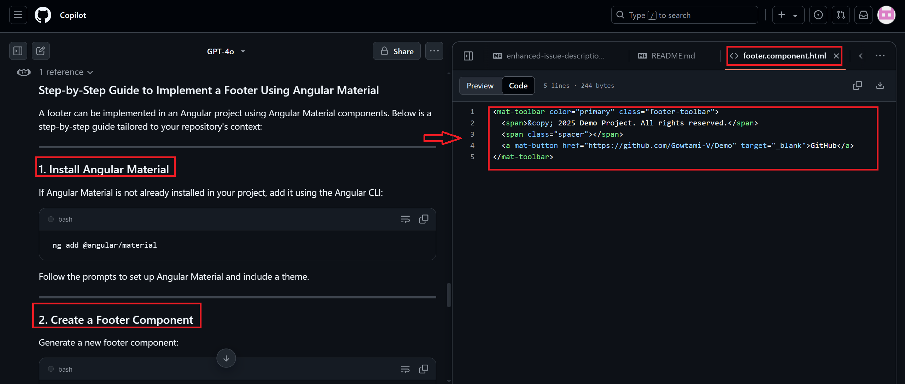
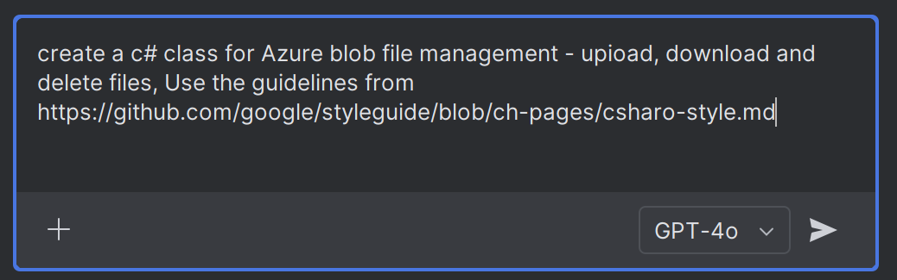
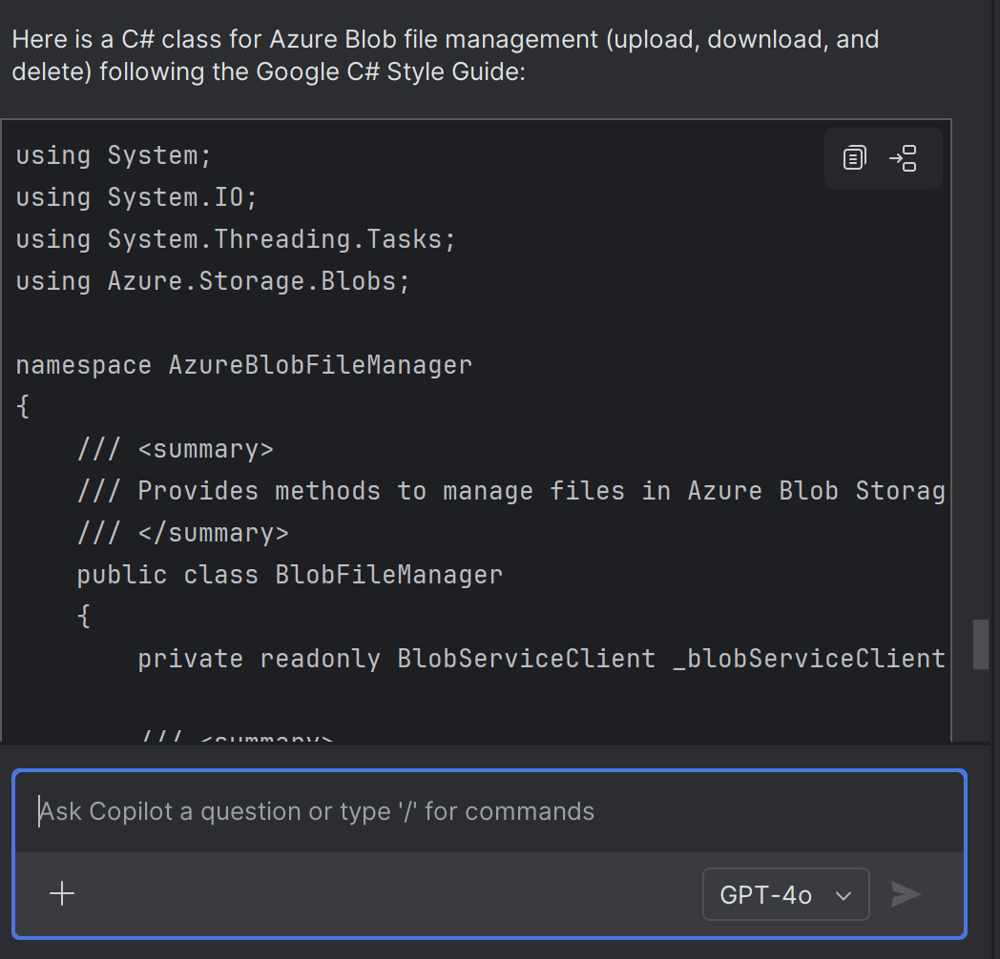

# **GitHub Copilot Can Now Read URLs! Paste Links & Get Smarter Code**

## **What’s New?**

GitHub Copilot Chat can now **understand context directly from GitHub and external URLs** — such as issues, pull requests, discussions, articles, documentation, etc.

---

## **Step-by-Step Guide to Using URL Context in GitHub Copilot Chat**

### **Step 1: Start with a GitHub Issue or File**

**1. Open a GitHub repository** with issues, discussions, or files.



**2. Copy the URL** of:

* An issue (e.g., bug report, feature request)
* A file you want to edit (e.g., `README.md`)
* A pull request or discussion

*Here I have opened the issue.*



---

### **Step 2: Paste the URL into Copilot Chat**

* Go to **Copilot Chat** (on GitHub.com).
  

* Paste the copied **URL**.

* Ask Copilot something like:

  

  ```
  Explain what this issue is about.  
  ```

* **Copilot will read the content** of the link and summarize it.

  

---

### **Step 3: Enhance the Issue or Discussion**

* You can refine or enhance the issue by asking:

  ```
  How can I enhance the issue details?
  ```

* **Copilot Output:**
  

---

### **Step 4: Use a File Link to Implement a Solution**

**1. Copy the URL of the target file (e.g., `README.md`).**

**2. Ask Copilot:**

   

**3. Copilot will use:**

   * The issue link (for context)
   * The file link (as a target)
   * And generate the implementation
   * It has implemented the license and contact details

   

---

### **Step 5: Combine External Resources**

You can now include **external documentation or articles**:

**1. Copy the URL of an article or style guide***
  

**2. Ask Copilot:**

  ```
  Use this article to implement a footer with Angular Material.
  ```

**3. Copilot will read the article and extract relevant patterns**
  

---

### **Step 6: Use in IntelliJ**

* Open **IntelliJ** with Copilot Chat enabled.

* Use the same workflow:

  1. Paste GitHub issue/file URL
  2. Paste article or doc link
  3. Open Copilot chat and ask Copilot chat to generate code
  4. Refine or implement based on suggestions
     

* **Copilot Output:**
  
